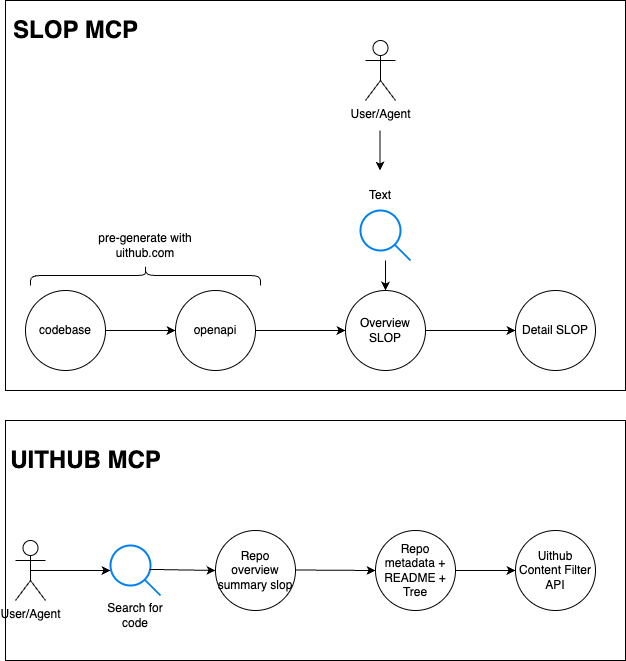

The following could be implemented as an MCP that knows how all APIs work:

```
Simple 4-step process:

1. Get context from openapisearch.com
2. Look up oapis.org/slop/{providerId}
3. Choose operation oapis.org/summary/{providerId}/{idOrRoute}
4. Write code
```

The next step will be the SLOP MCP and UITHUB MCP:



Let's talk on [X](https://x.com/janwilmake) if you have any thoughts/feedback/ideas. Let's build this in the open for a decentralised intelligent internet!
